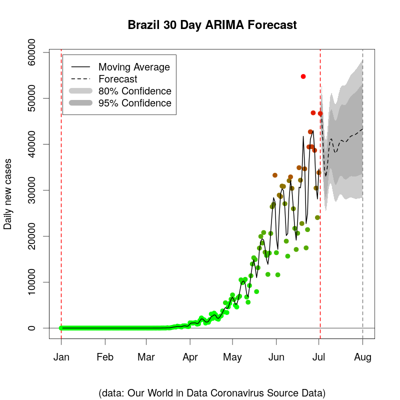

# Time series analysis of COVID19 data using R. 



This project is a self learning experiment with time series forecasting models in R. The long term goal of this project is to build a Rshiny dashboard to forecast the new daily cases of COVID 19. 

DISCLAIMER: I do not claim to be an epidemiologist in any capacity. This work in no way claims to account for easing of stay-at-home mandates, social distancing, mask usage, and other factors. 

**Clone this repository:**

`git clone https://github.com/johnfmaner/covid19`

## Contents 

### /data
This project uses the Our World In Data COVID19 data found on Github: (https://github.com/owid/covid-19-data) or the official website (https://ourworldindata.org/coronavirus-source-data). 

This folder includes a bash script to download the most recent data release. This data includes 212 unique locations, so it may be easily adapted to other countries or continents. Additionally, the data may be directly downloaded in R using the helper function `download.owid(download.dir, file.name)`

### /figures
Sample figures of TBATS, ETS, and ARIMA forecasting of COVID19 daily new cases data in Mexico, United States, Italy, and Brazil. The spike in new cases per day in late June diverges from the predictable periodic behavior seen beginning clearly in May through the middle of June. 

### timeseriesHelpers.R
Helper functions to download data, create time series, subsets by country, and generate forecast values over an interval with a specified model. 

### timeseriesPrediction.R
Loads owid_covid.csv data and performs forecasting for specified country. One can specify the time series start and end points, forecasting model, and country. 

A bare minimum example: 

**Perform 30 day ARIMA Forecast for Brazil on daily new cases from 01-01-2020 to 07-02-2020 using timeseriesHelpers.R:** 

```
myDir <- "~/Documents/projects/covid/" #specify your directory
setwd(myDir)

library(forecast) #moving average, forecasting
library(lubridate) #working with dates
source("timeseriesHelpers.R") #load helper functions

myData <- paste(myDir, "data/",sep="")
myFile <- "owid-covid.csv"

download.owid(myData, myFile)
dataIn <- read.csv(paste(myData, myFile, sep=""), header=TRUE)

covid <- myCountry(dataIn, "Brazil")
data <- myTimeseries(covid, "new_cases", ymd("2020-01-01"), ymd("2020-07-02"))

Fcast <- myForecast(source=data, type="arima", predInt=30)
plot(Fcast)

```


## To do
- [x] Create bash script to download data directly from OWID website. 
- [X] Easily swap between country and forecasting models
- [X] Add helper functions. 
- [ ] Use predictions to calculate total cases, compare to predictions built on total cases? 
- [ ] Build shiny dashboard

